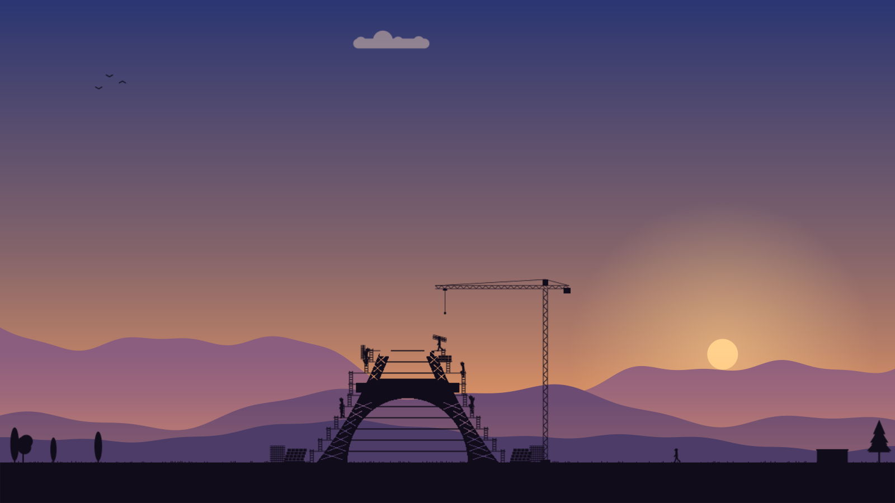
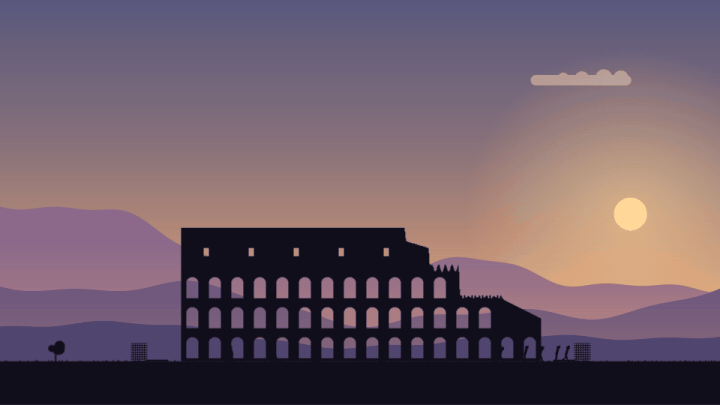
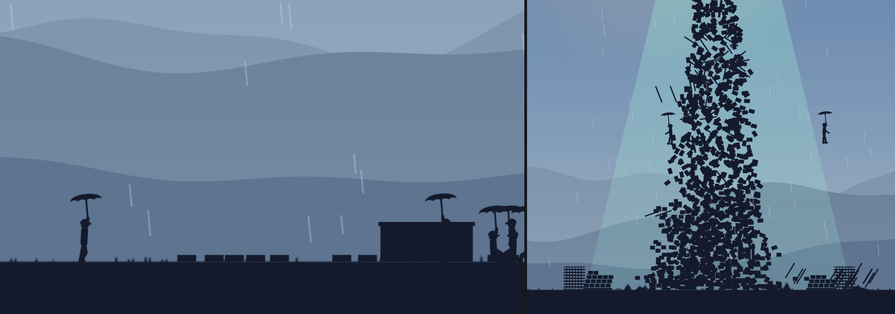
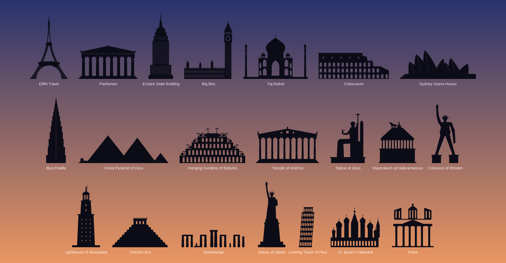
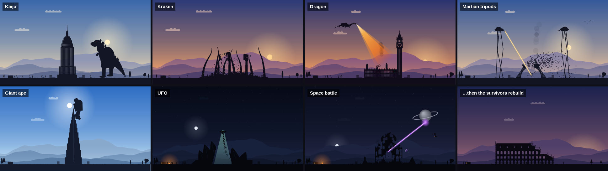
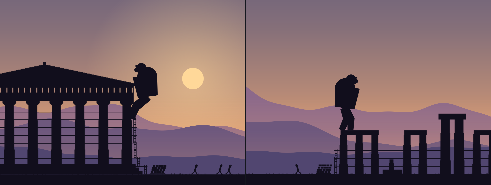
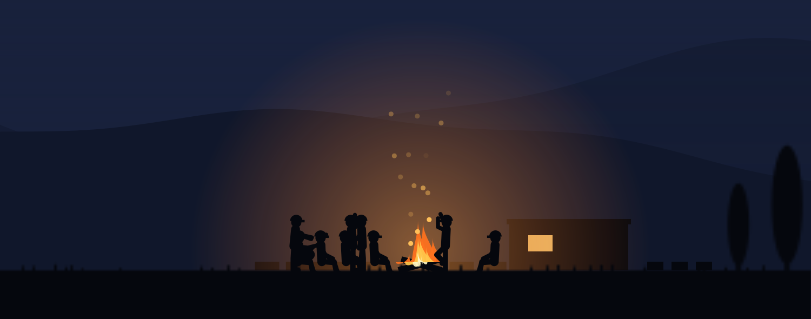
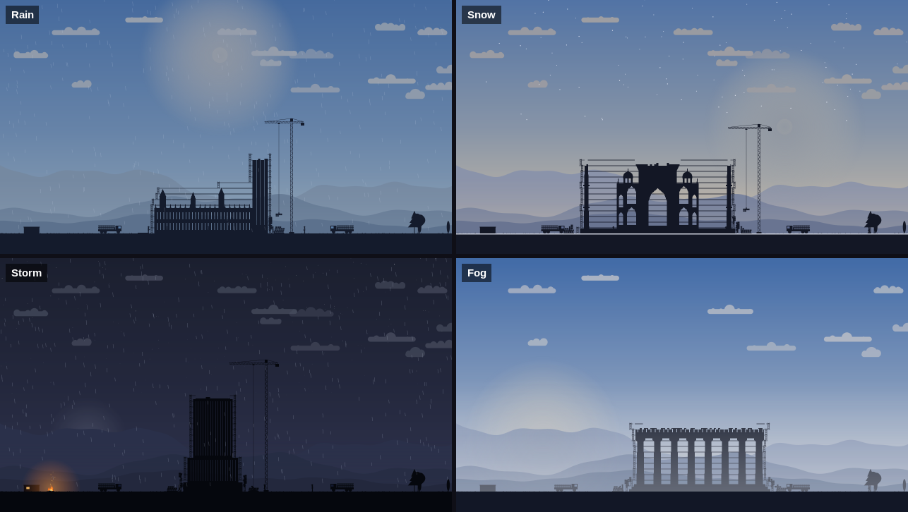
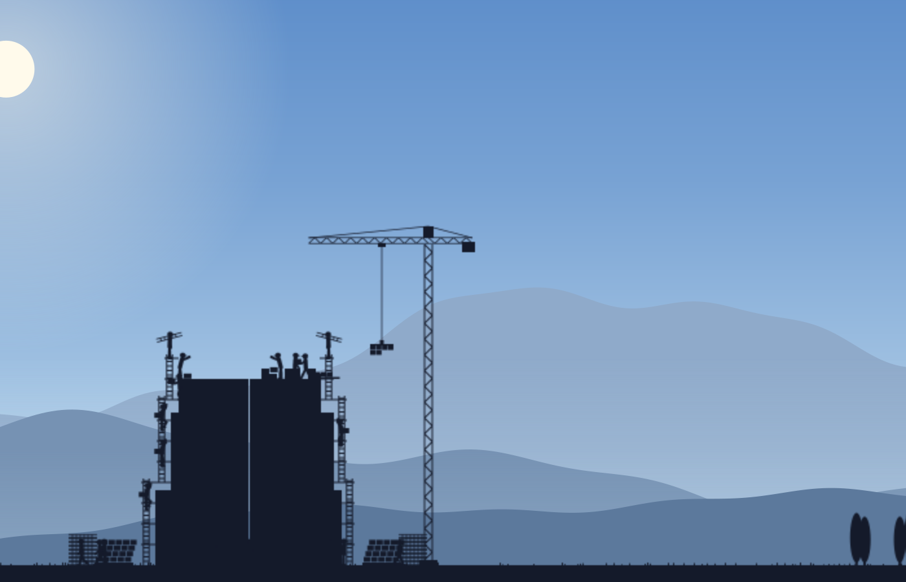
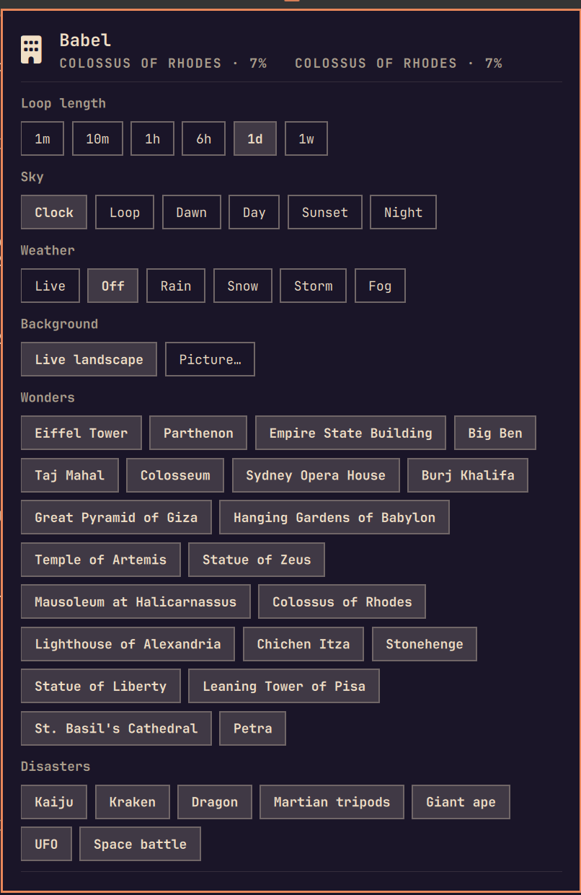

# Babel

**A live wallpaper theme for [Omarchy](https://omarchy.org).** A tiny crew builds the wonders of
the world on your desktop, block by block. Then a monster flattens it. Then they start again.





## What happens on your desktop

- A flatbed **truck** brings pallets of blocks and a load of ladder sections.
- **Scaffolders** carry ladders up and raise the scaffold one level at a time. Block carriers
  climb it, set each block in place, and climb back down for the next one.
- Tall monuments get a **tower crane**: it arrives on a truck, climbs as the building rises,
  lifts pallets up to the working floor, and leaves again when the job is done.
- **Nothing floats.** A level is worked only once the floor under it is finished, planks
  bridge arches and colonnades, every block goes in touching the ground or blocks already in
  place, and nobody ever stands on thin air.
- When the monument stands, the scaffold comes down. At the end of the cycle a **disaster**
  strikes, the survivors run for it, walk back, clear the rubble and start the next wonder.
- **After dark** the crew downs tools and takes a seat round the campfire for the night.
  Someone plays the guitar while others dance or clap along, talk, drink, throw another log
  on, and late at night doze off by the fire or turn in at the container. Thunderstorms send
  them to shelter by the site container.
- **Umbrellas.** About half the crew carry one. In the rain they open it whenever they have a
  hand free, and when a disaster strikes in daylight, some of those up on the building open it
  and jump, drifting down with the wind.
- **The giant ape holds on to what's really there.** It climbs real walls, hauls itself onto
  low roofs, scrambles up pyramids, and drops when the blocks it holds are smashed. Breath,
  fire and heat-rays stop at the first stone they hit and burn their way in.
- **Covered monitors keep going.** They aren't drawn, but the build and the crew carry on in
  the background, so nothing jumps when you look again.



You choose how long a cycle lasts, from one minute (forty workers in time-lapse) to one week
(a handful of people laying a block every few minutes). Progress follows the wall clock and is
saved, so a week-long build carries on after a reboot.

## 21 wonders



- **The Seven Wonders of the Ancient World:** Great Pyramid of Giza, Hanging Gardens of
  Babylon, Temple of Artemis, Statue of Zeus, Mausoleum at Halicarnassus, Colossus of Rhodes,
  Lighthouse of Alexandria
- **Landmarks:** Eiffel Tower, Parthenon, Empire State Building, Big Ben, Taj Mahal, Colosseum,
  Sydney Opera House, Burj Khalifa, Chichen Itza, Stonehenge, Statue of Liberty, Leaning Tower
  of Pisa, St. Basil's Cathedral, Petra

The Lighthouse's fire and the torches of the Colossus and the Statue of Liberty glow at night.

## 7 disasters



| Disaster | What happens |
|---|---|
| **Kaiju** | Walks in, roars, sweeps its atomic breath across the building and walks through it |
| **Kraken** | Tentacles burst out of the ground, sway, then slam across the monument and drag it down |
| **Dragon** | Flies in, breathes fire down the building, swoops over and burns it from the other side |
| **Martian tripods** | Two towering fighting machines stride in and sweep their heat-rays across it |
| **Giant ape** | Climbs to the top, beats its chest, and smashes its way down |
| **UFO** | Hovers overhead and beams the building (and any slow workers) up |
| **Space battle** | A ringed fortress-planet sends fighters on strafing runs, then fires its main beam |



All of them are original drawings, inspired by myth, H. G. Wells' *The War of the Worlds*
(public domain) and classic monster-movie tropes.

**The finale waits for an audience.** A disaster only starts on a monitor whose workspace is
empty, a couple of seconds after you switch to it, so you don't miss it while you're working.

## A living sky



- **The real sun and moon.** They rise and set at the real times for your location, follow
  their real paths across the sky, and the moon shows its real phase. Sky colours follow the
  sun's height, so dawn, golden hour, dusk and night match the window.
- **The real weather.** Clouds drift with the wind, rain and snow roll in and ease off, snow
  settles on the ground, fog lifts, and storms bring lightning.



The location is the one Omarchy's own weather widget uses. You can also let the day loop on
its own (a whole day every 2 minutes to 6 hours), or pin dawn, day, sunset or night.



## Install

Two ways in, same result. Everything Babel needs (Python 3.11+, PyGObject, pycairo,
gtk4-layer-shell) is already on a stock Omarchy install.

### From the plugin marketplace (easiest)

```bash
omarchy plugin add https://github.com/G-Pappas/babel --enable
```

A Babel icon (a little building) appears on the top bar. **Click it and press _Turn on Babel_.**
That's all: it sets Babel up and switches your theme to it.

### As a theme

```bash
omarchy theme install https://github.com/G-Pappas/babel
~/.config/omarchy/themes/babel/live/babel-theme install
```

The second command matters: Omarchy (rightly) never runs code from a theme on its own, so
without it you'd only get Babel's colours and a still picture, not the live wallpaper.

### What "Turn on Babel" (or `babel-theme install`) does

- adds the hooks that start the live wallpaper whenever Babel is your theme, stop it when you
  switch to another theme, and start it again after a reboot;
- adds the **Babel icon to the top bar** (it hides itself under other themes);
- adds a **Style > Babel** submenu to the Omarchy menu;
- links the `babel-theme` command into `~/.local/bin`;
- switches your theme to Babel.

To leave, just pick another theme (Style > Theme); come back the same way. To remove Babel
completely, run `babel-theme uninstall`, then `omarchy plugin remove gpappas.babel` or
`omarchy theme remove babel` (whichever way you installed it).

## Settings

Click the Babel icon on the top bar:



- **Loop length:** how long one build-and-disaster cycle takes (1m, 10m, 1h, 6h, 1d, 1w)
- **Sky:** follow the clock, loop, or pin dawn / day / sunset / night
- **Weather:** live, off, or pin rain / snow / storm / fog
- **Background:** the live landscape, or any picture (Omarchy's image picker opens; your own
  pictures can go in `~/.config/omarchy/backgrounds/babel/`)
- **Wonders** and **Disasters:** click to switch each one on or off; **Reset** turns them all on
- **Disaster now**, if you can't wait

The same settings are in the Omarchy menu under **Style > Babel**, and on the command line:

```bash
babel-theme status
babel-theme cycle 6h
babel-theme sky loop && babel-theme sky-loop 10m
babel-theme weather live
babel-theme toggle wonder colossus
babel-theme toggle disaster kraken
babel-theme background pick
babel-theme reset
babel-theme disaster-now
babel-theme monitors span                 # or: separate
babel-theme wonder-monitor HDMI-A-1       # or: auto
```

Everything is stored in `~/.config/babel-live/config.toml` and applies within a few seconds,
with no restart.

## How it behaves

- **Every block is placed by a worker.** Each cycle plans its crew from the time it has: first
  it hires more workers (up to 40), then the crew works in time-lapse, and for very short
  cycles the monument is cut into bigger blocks. On cycles of two hours or more the schedule
  only counts daylight hours, so the build still finishes on time despite the nights off.
- **Hidden monitors cost next to nothing.** A monitor whose workspace has windows on it isn't
  drawn at all, but its scene keeps going in the background at a few updates a second, so the
  build and the crew are exactly where they should be when you look again. With one monitor
  showing the scene, Babel uses about 5% of one CPU core.
- **The crew never hurries.** Their pace is planned once per cycle and never changes; if they
  fall behind, an extra worker walks in to help.
- **Several monitors make one wide scene.** The wonder goes up whole on one monitor (the
  biggest, or the one you pick) and the monitor beside it is the crew's yard: their container
  and campfire, and the stockyard where pallets and ladder sections wait and the truck loads
  up before driving across to the site. The crew walks over for breaks and for the evening
  fire, and monsters come in from the outer edge of the screen, never out of thin air in the
  yard. `babel-theme monitors separate` gives every monitor a wonder of its own instead.

### Privacy

Live weather asks [Open-Meteo](https://open-meteo.com) for the current conditions at the
coordinates in Omarchy's weather settings (`~/.local/state/omarchy/settings/weather.json`),
every 20 minutes. If only a city name is set it is looked up with Open-Meteo's geocoding; if
nothing is set, the city is guessed from your IP address via wttr.in, as Omarchy's weather
widget does. Set **Weather** to **off** and Babel makes no network requests at all.

## Development

```bash
live/babel-live.py --window --cycle 10m          # run in a normal window
live/babel-live.py --snapshot out.png --monument eiffel --disaster kaiju --at 9 --hour 19
live/babel-live.py --snapshot out.png --monument parthenon --weather storm --hour 21
live/babel-live.py --snapshot out.png --monument eiffel --span left   # two monitors wide
```

| File | What's in it |
|---|---|
| `live/babel-live.py` | The app: one layer-shell window per monitor showing its slice of a scene, the frame loop, Hyprland visibility |
| `live/babel-theme` | Setup, uninstall and settings command |
| `manifest.json`, `Widget.qml` | The top-bar widget (an Omarchy shell plugin, `gpappas.babel`) |
| `live/engine/world.py` | One scene (a monitor, or several side by side): the cycle, crew planning, physics rules, drawing |
| `live/engine/people.py` | The workers: how they're drawn and their jobs |
| `live/engine/site.py` | Scaffold, delivery trucks and the tower crane |
| `live/engine/monuments.py` | The 21 wonders, drawn as outlines and cut into blocks |
| `live/engine/disasters.py` | The 7 disasters |
| `live/engine/sky.py`, `astro.py`, `weather.py` | Landscape, sun and moon positions, live weather |

## License

[MIT](LICENSE). Not affiliated with Omarchy.
